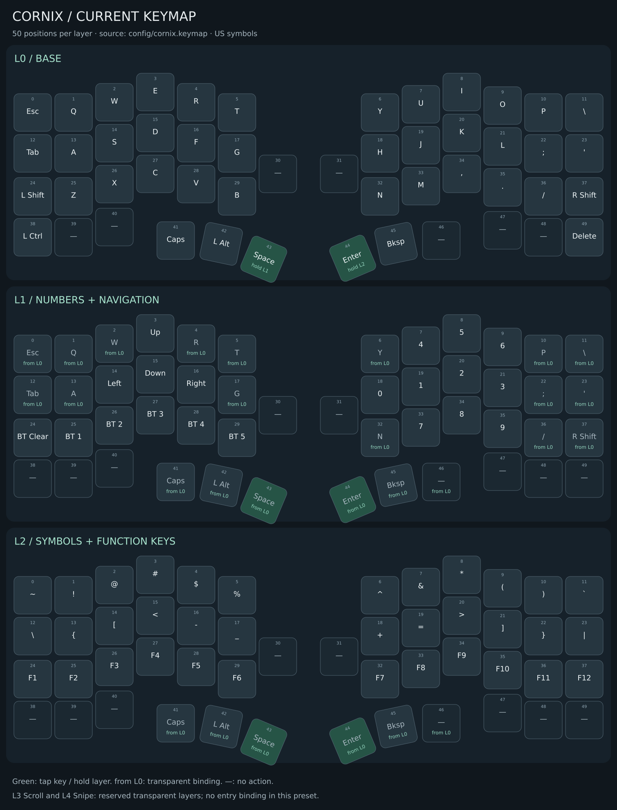

# ZMK Keyboard for Cornix

ZMK board definitions and shields for the Cornix split ergonomic keyboard.

[Documentation: English / 简体中文](http://gh.bhee.online/zmk-keyboard-cornix/) ·
[简体中文 README](./README_zh.md) ·
[日本語 README (AI-generated)](./README_jp.md)

**Current board release:** [`v3.0.0`](https://github.com/hitsmaxft/zmk-keyboard-cornix/releases/tag/v3.0.0)

**ZMK baseline:** `main` with Zephyr 4.1


## What is included

- `cornix_left//zmk` — left half for a standard split build
- `cornix_right//zmk` — right peripheral half
- `cornix_ph_left//zmk` — left peripheral half for a dongle build
- `cornix_dongle_adapter` — central dongle matrix and Bluetooth role
- `cornix_dongle_eyelash` — optional display hardware overlay
- `cornix_indicator` — production-ready RGB battery and connection indicators

Cornix uses a compact 3×6 column-staggered layout with three thumb keys per
half. The hardware supports USB-C, Bluetooth, Kailh Choc V2 hot-swap sockets,
and 10°, 18°, or 25° tenting.

## Current keymap

The current preset uses 50 binding positions. The diagram below shows all positions
on the three active layers, including unassigned keys:

- **L0 Base:** Space held activates L1; Enter held activates L2.
- **L1 Num/Nav:** arrows on E/S/D/F and Ctrl shortcuts on Z/X/C/V; BT Clear and BT 1–3 on the leftmost column. Right-hand digits use 789 / 456 / 0123, with decimal above zero.
- **L2 Fn/Symbol:** two rows of symbols, with F1–F12 on the third row.



[Full-size PNG](keymap-drawer/cornix.png) · [Offline keymap editor](keymap-drawer/cornix.html)
(download the HTML and open it locally).
The editor supports physical-keyboard input, drag-to-swap and exporting an edited HTML.

Green keys have tap/hold behavior; `from L0` indicates a transparent binding shown
with its base-layer fallback; `—` is unassigned. Scroll and Snipe remain transparent
reserved layers with no entry binding. This reflects `config/cornix.keymap`, not
the v3.0.0 release package or changes saved on a device through Studio.

Regenerate the HTML and diagrams after keymap edits with
`python scripts/generate-keymap-image.py` (requires Pillow).

## Zephyr 4.1 requirements

Always use qualified ZMK board names such as `nice_nano//zmk`. The unqualified
`nice_nano` target may select `CONFIG_SETTINGS_NONE=y`, discard the Bluetooth
identity after reboot, and break existing split bonds.

For every nice!nano dongle or reset build, verify the final `.config` contains:

```text
CONFIG_NVS=y
CONFIG_SETTINGS_NVS=y
```

It must not contain `CONFIG_SETTINGS_NONE=y`.

## Build targets

Standard split:

```yaml
include:
  - board: cornix_left//zmk
    artifact-name: cornix_left

  - board: cornix_right//zmk
    artifact-name: cornix_right

  - board: cornix_right//zmk
    shield: settings_reset
    artifact-name: cornix_reset
```

Dongle integration:

```yaml
include:
  - board: nice_nano//zmk
    shield: cornix_dongle_adapter cornix_dongle_eyelash cornix_dongle_display
    snippet: studio-rpc-usb-uart
    artifact-name: cornix_dongle

  - board: cornix_ph_left//zmk
    artifact-name: cornix_left_for_dongle

  - board: cornix_right//zmk
    artifact-name: cornix_right

  - board: nice_nano//zmk
    shield: settings_reset
    artifact-name: dongle_reset
```

Use `cornix_dongle_eyelash` only when the dongle board does not already expose
`zephyr,display`. The local `cornix_dongle_display` shield supplies the display widgets and
Salary Cat (月薪喵) animation. See [implementation and validation](boards/shields/cornix_dongle_display/UPSTREAM.md)
and [artwork attribution](boards/shields/cornix_dongle_display/ASSETS.md).
Display-only updates require flashing the dongle only, without a settings reset.

## RGB indicators

Version 3.0.0 makes the optional `cornix_indicator` shield production-ready.
It uses `zmk-rgbled-widget` to show battery and split-connection state.

The shield sets `CONFIG_RGBLED_WIDGET_EXT_POWER_TIMEOUT_MS=1000`. When no
animation or static indicator remains active, the WS2812 power rail is turned
off after 1000 ms to reduce idle consumption. LEDs that remain illuminated
still consume power. RGB is opt-in and is not enabled in the default v3.0.0
release artifacts.

## Flashing and recovery

1. Flash the matching settings-reset UF2 to every role whose bonds must be
   cleared.
2. Flash the left, right, and optional dongle UF2 files to their matching
   devices.
3. Reset both halves together and then reconnect the host.

Cornix has used the no-SoftDevice flash layout since v2.3. For older firmware,
stock RMK interoperability, or a board that no longer enters UF2 mode, follow
the [bootloader recovery guide](./bootloader/README.md). Do not mix firmware
roles or flash layouts without resetting the affected devices.

## Documentation and support

- [English installation guide](http://gh.bhee.online/zmk-keyboard-cornix/en/)
- [中文安装指南](http://gh.bhee.online/zmk-keyboard-cornix/zh/)
- [ZMK documentation](https://zmk.dev/docs/)
- [Issue tracker](https://github.com/hitsmaxft/zmk-keyboard-cornix/issues)
- [RMK firmware project](https://rmk.rs/)
